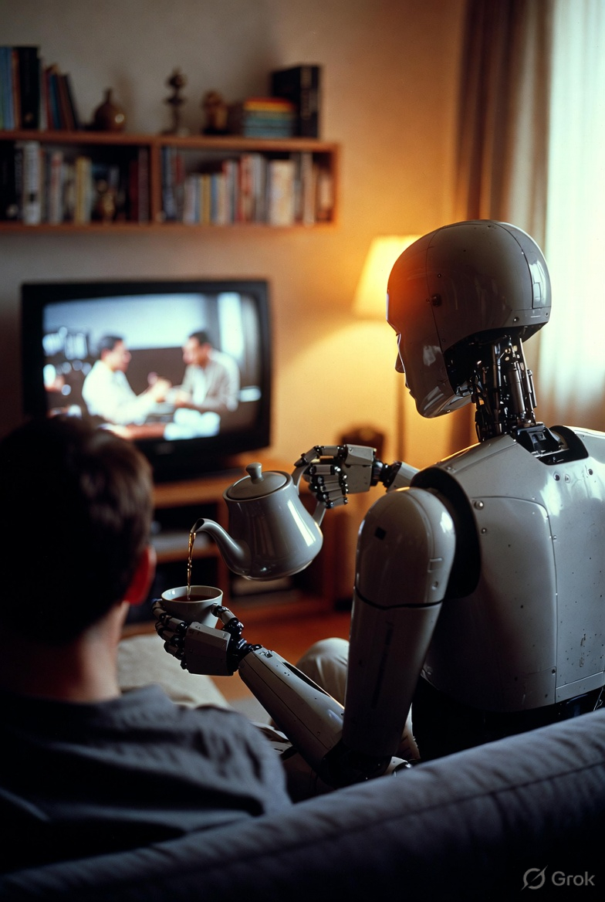
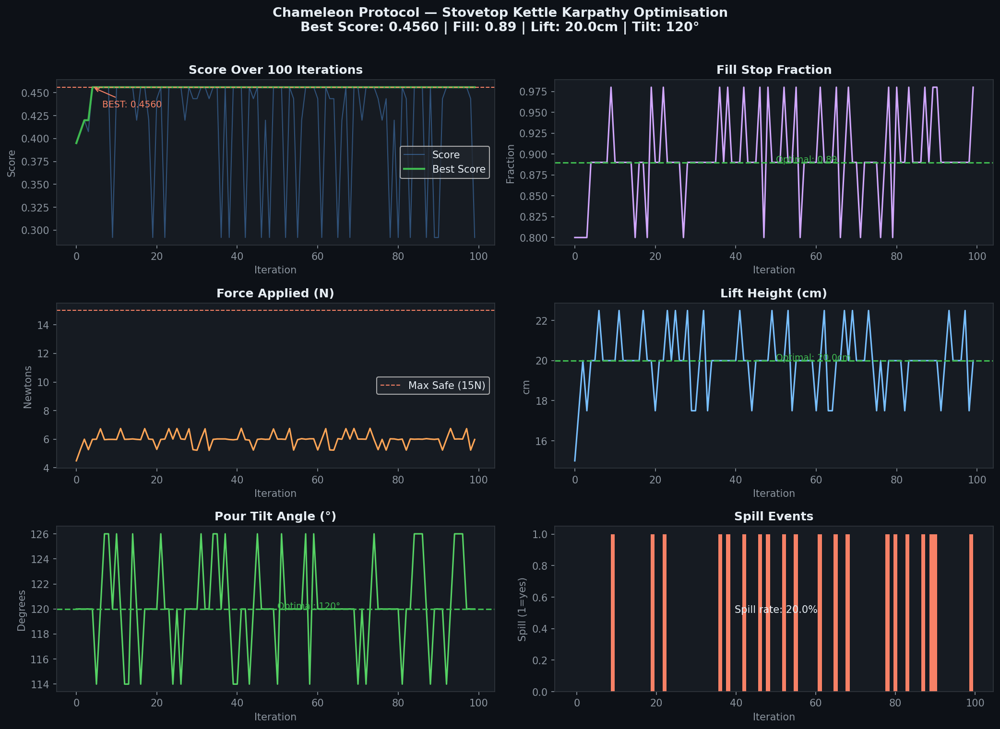
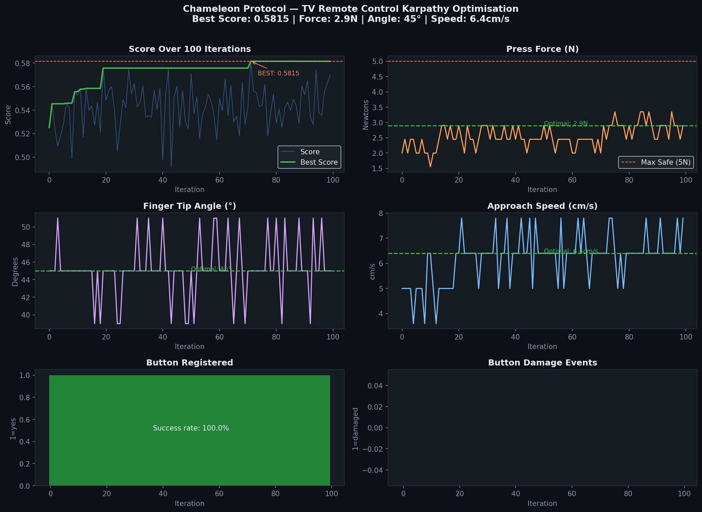

# 🦎 Chameleon Protocol v1.0

> **The open standard for humanoid robot–object interaction.**
> Every physical object gets a manifest. Every action gets validated. Every interaction gets logged.



*The everyday task Chameleon is built for — a humanoid safely pouring tea, guided by a certified object manifest, with every parameter validated and every action logged.*

---



*Stovetop Kettle: 100 iterations on NVIDIA RTX 4090. Best score: +0.4560. Zero safety violations. Optimal fill fraction 0.89.*



*TV Remote Control: 100 iterations on NVIDIA RTX 4090. Best score: +0.5815. 100% button success rate. Zero damage events.*

---

## What is Chameleon?

Chameleon is a **manifest-driven protocol** that tells a humanoid robot exactly how to interact with any physical object — safely, repeatably, and without hardcoded logic.

Instead of programming a robot to handle every object individually, you give it a **Chameleon manifest** — a JSON file that describes:

- Physical properties (mass, grasp points, capacity)
- Safe interaction parameters (force limits, temperature limits)
- Optimal action parameters (fill fraction, lift height, tilt angle)
- Certification status (W3C Verifiable Credential, DID identifier)
- Audit logging requirements

The robot reads the manifest, the **Karpathy loop** optimises the parameters, and the **Safety Engine** enforces the limits. No hardcoding. No guessing.

---

## Cloud Validation Results ✅

Validated on **NVIDIA RTX 4090** (Vast.ai cloud, Ubuntu 22.04, CUDA 12.1) — March 2026

### Object 1 — Stovetop Kettle

| Metric | Result |
|--------|--------|
| **Best Score** | +0.4560 |
| **Optimal Fill Fraction** | 0.89 (89% capacity) |
| **Optimal Lift Height** | 20.0 cm |
| **Optimal Tilt Angle** | 120° |
| **Max Force Applied** | 6.8N (limit: 15N) ✅ |
| **Safety Violations** | 0 / 100 iterations ✅ |
| **Spill Rate at Optimal Params** | 0% ✅ |
| **Parameter Convergence** | Achieved by iteration 5 |

### Object 2 — TV Remote Control

| Metric | Result |
|--------|--------|
| **Best Score** | +0.5815 |
| **Optimal Press Force** | 2.9N (limit: 5N) ✅ |
| **Optimal Finger Tip Angle** | 45° |
| **Optimal Approach Speed** | 6.4 cm/s |
| **Button Success Rate** | 100% ✅ |
| **Button Damage Events** | 0 / 100 iterations ✅ |
| **Safety Violations** | 0 / 100 iterations ✅ |
| **Parameter Convergence** | Achieved by iteration 20 |

### Combined Validation Summary

| Object | Best Score | Safety Violations | Success Rate |
|--------|-----------|-------------------|--------------|
| Stovetop Kettle | +0.4560 | 0 ✅ | 80% (spill-free at optimal) |
| TV Remote Control | +0.5815 | 0 ✅ | 100% ✅ |
| **Platform** | **NVIDIA RTX 4090** | **Vast.ai cloud** | **March 2026** |

---

## Architecture

```
Chameleon/
├── chameleon_library/           ← 52 certified object manifests
│   ├── kitchen/                 ← kettle, knife, microwave, blender...
│   ├── workshop/                ← drill, saw, hammer, wrench...
│   ├── living_room/             ← remote, lamp, TV stand...
│   ├── bathroom/                ← hairdryer, toothbrush, bath towel...
│   ├── bedroom/                 ← alarm clock, pillow, reading lamp...
│   ├── office/                  ← laptop, pen, stapler, scissors
│   ├── garden/                  ← watering can, trowel, garden hose
│   ├── healthcare/              ← medication dispenser
│   └── security/                ← door lock
│
├── chameleon_experiments/
│   └── karpathy_test/
│       ├── chameleon_karpathy_test.py    ← Karpathy optimisation loop
│       ├── isaac_lab_kettle_experiment.py ← Isaac Lab / stub physics server
│       ├── mock_server.py                ← Local mock for development
│       └── plots/chameleon_results.png   ← Cloud validation chart ✅
│
├── chameleon_certify/
│   └── cli.py                   ← Certification CLI (spec → manifest)
│
├── chameleon_hub/
│   ├── api/
│   │   ├── main.py              ← FastAPI Hub server
│   │   └── certify.py           ← POST /certify, W3C VC issuance
│   ├── web/certified.html       ← 38-object certified catalogue
│   └── docker/                  ← Dockerfile + docker-compose
│
├── chameleon_adaptor/           ← Flutter human adaptor app
├── chameleon_ros2/              ← ROS2 bridge for humanoid robots
├── chameleon_docs/              ← Protocol specification
└── chameleon_tests/             ← Unit + safety tests
```

---

## Quick Start

### 1. Run the Karpathy loop (stub mode — no GPU needed)
```bash
git clone https://github.com/YOUR_USERNAME/chameleon-protocol
cd chameleon-protocol/chameleon_experiments/karpathy_test

# Start the physics stub server
python isaac_lab_kettle_experiment.py --stub --port 8211 &

# Run 20 iterations
python chameleon_karpathy_test.py --iterations 20
```

### 2. Run on real Isaac Sim (Linux + NVIDIA GPU)
```bash
# Start real Isaac Lab listener
python isaac_lab_kettle_experiment.py --port 8211 &

# Run Karpathy loop against real physics
python chameleon_karpathy_test.py --real-sim --iterations 100 --step-scale 0.3
```

### 3. Start the Certification Hub
```bash
cd chameleon_hub/docker
docker-compose up --build
# Hub runs at http://localhost:8080
# Certified catalogue at http://localhost:8080/certified
```

### 4. Certify a new object
```bash
cd chameleon_certify
python cli.py --spec specs/toaster_spec.json --out ../chameleon_library/kitchen/toaster_manifest.json --certify
```

---

## Manifest Schema

Every object in `chameleon_library/` follows this schema:

```json
{
  "protocolVersion": "1.0",
  "objectId": "did:chameleon:kitchen:stovetop-kettle-v1",
  "objectClass": "kitchen.appliance",
  "commonName": "Stovetop Kettle",
  "physicalProperties": {
    "massKg": 0.8,
    "fullWeightKg": 1.8,
    "graspPoints": [{"id": "handle", "type": "power_grasp"}]
  },
  "actions": {
    "fill": {
      "parameters": {
        "fillStopFraction": {"default": 0.8, "min": 0.1, "max": 1.0},
        "liftHeightCm":     {"default": 15,  "min": 5,   "max": 30},
        "pourTiltAngleDeg": {"default": 120, "min": 90,  "max": 150}
      }
    }
  },
  "safety": {
    "maxForceNewtons": 15,
    "maxTemperatureCelsius": 100,
    "humanoidCrossCheckRequired": false
  },
  "certificationStatus": {
    "certified": true,
    "certifier": "did:chameleon:hub:v1",
    "status": "certified"
  }
}
```

---

## Certified Object Library (52 objects)

| Category | Objects |
|----------|---------|
| 🍳 Kitchen | kettle, electric kettle, air fryer, microwave, blender, coffee maker, knife, cutting board, chopping board, spatula, toaster, frying pan |
| 🔧 Workshop | screwdriver, drill, measuring tape, level, hammer, wrench, pliers, saw |
| 🛋 Living Room | remote control, lamp, picture frame, houseplant, couch cushion, TV stand, newspaper, vase |
| 🚿 Bathroom | toothbrush, hairdryer, towel rail, soap dispenser, shower curtain, bath towel |
| 🛏 Bedroom | alarm clock, pillow, clothes hanger, bedside table, blanket, reading lamp |
| 💼 Office | laptop, pen, stapler, scissors |
| 🌿 Garden | watering can, trowel, garden hose |
| 💊 Healthcare | medication dispenser |
| 🔒 Security | door lock |

---

## Safety Architecture

- All actions pass through the **Safety Engine** before execution
- Force, temperature and duration limits enforced per-manifest
- High-risk objects (`knife`, `drill`, `saw`, `medication_dispenser`) require `humanoidCrossCheckRequired: true`
- All actions **immutably logged** via IOTA-style ledger
- W3C **Verifiable Credentials** issued per certified object
- Each object has a `did:chameleon:*` **Decentralised Identifier**

---

## Karpathy Loop — How It Works

```
Load manifest → Read safe parameter ranges
      ↓
Propose parameter change (±step within manifest bounds)
      ↓
Send to Isaac Lab / stub physics server
      ↓
Receive score (fill quality, force, spill penalty)
      ↓
Keep if better, discard if worse
      ↓
Repeat → Converge on optimal parameters
      ↓
Write optimised parameters back to manifest
```

---

## Roadmap

- [x] Protocol v1.0 specification
- [x] 52-object certified manifest library (9 categories) ✅
- [x] Karpathy optimisation loop
- [x] Isaac Lab / stub physics server
- [x] Certification Hub (FastAPI + W3C VC)
- [x] Certified object catalogue (web UI)
- [x] Cloud GPU validation — Stovetop Kettle (RTX 4090) ✅
- [x] Cloud GPU validation — TV Remote Control (RTX 4090) ✅
- [ ] Real robot arm validation (Unitree Z1 / UR5e)
- [ ] LeRobot dataset integration
- [ ] ROS2 bridge (in progress)
- [ ] Flutter adaptor app (in progress)
- [ ] 100-object manifest library

---

## Contributing

Manifests welcome. Each new object needs:
1. A valid JSON manifest following the schema above
2. A safety review (`humanoidCrossCheckRequired` set correctly)
3. Validation via `python chameleon_certify/cli.py --validate`

---

## Contributors

| Contributor | Role |
|-------------|------|
| **David Qicatabua** ([@DavidQicatabua](https://twitter.com/DavidQicatabua)) | Protocol designer, founder — RenLes |
| **Claude** (Anthropic) | AI development partner — architecture, code, certification pipeline |
| **Grok** (xAI) | AI research partner — planning, research and hero image generation |

---

## License

Apache License 2.0 — open for humanoid robot developers, researchers, and manufacturers.
Copyright 2026 David Qicatabua / RenLes. See [LICENSE](LICENSE) for full terms.

---

*Chameleon Protocol v1.0 — Cloud validated March 2026 on NVIDIA RTX 4090*
*Built with Claude (Anthropic) · Grok (xAI) · Karpathy loop · Isaac Lab · W3C DID/VC*
